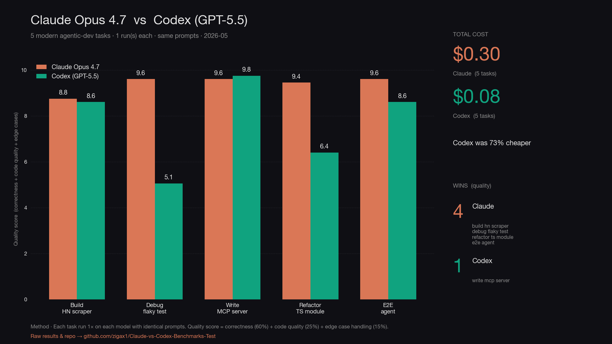

# Results

> **claude-opus-4-7** vs **gpt-5.5** — 5 modern agentic-dev tasks, 1 run per model, same prompts both sides.
> Run 2026-05-19 by @ZigaSetar.



## Headline

| | Claude Opus 4.7 | Codex (GPT-5.5) |
|---|:---:|:---:|
| **Quality wins** | **4** / 5 | 1 / 5 |
| **Total cost** | $0.30 | **$0.08** |
| **Tasks won** | Build HN scraper, Debug flaky test, Refactor TS module, E2E agent | Write MCP server |

_Codex was **73% cheaper** on these deliverables._

## Per-task scoreboard

| # | Task | Claude | Codex | Winner | Claude $ | Codex $ |
|:-:|------|:------:|:-----:|:------:|---------:|--------:|
| 1 | Build HN scraper | 8.75 | 8.60 | **Claude** | $0.04 | $0.0057 |
| 2 | Debug flaky test | 9.60 | 5.05 | **Claude** | $0.0093 | $0.0019 |
| 3 | Write MCP server | 9.60 | 9.75 | **Codex** | $0.05 | $0.02 |
| 4 | Refactor TS module | 9.45 | 6.40 | **Claude** | $0.13 | $0.04 |
| 5 | E2E agent | 9.60 | 8.60 | **Claude** | $0.07 | $0.02 |

## Per-task detail

### Task 1 — Build HN scraper  ·  _Claude wins_

| Model | Correctness · 60% | Code quality · 25% | Edge cases · 15% | **Quality** | Cost | Tokens (in / out) |
|-------|:-----------------:|:------------------:|:----------------:|:-----------:|-----:|:-----------------:|
| **Claude** | 9 | 8 | 9 | **8.75** | $0.04 | 238 / 1407 |
| **Codex** | 9 | 8 | 8 | **8.60** | $0.0057 | 176 / 546 |

> **Claude — observations.** Ran cleanly, returned 30 valid items, 0 nulls. Extracts age as ISO timestamp via the title attribute on .age (more parseable downstream than Codex's '3 hours ago' string). Adds an is_ask_hn flag and falls back URL to the HN discussion page — useful but slightly beyond spec.

> **Codex — observations.** Cleaner, more idiomatic Playwright (uses page.$$eval, no helper functions). 30 valid items, 0 nulls when run. Returns url:null for Ask HN per spec — more literal interpretation. Did not install playwright itself ('would add files outside the approved single-file slice') so did not self-verify; verified externally.

### Task 2 — Debug flaky test  ·  _Claude wins_

| Model | Correctness · 60% | Code quality · 25% | Edge cases · 15% | **Quality** | Cost | Tokens (in / out) |
|-------|:-----------------:|:------------------:|:----------------:|:-----------:|-----:|:-----------------:|
| **Claude** | 10 | 9 | 9 | **9.60** | $0.0093 | 344 / 305 |
| **Codex** | 4 | 7 | 6 | **5.05** | $0.0019 | 255 / 157 |

> **Claude — observations.** Correct diagnosis of the .all() snapshot vs auto-retry race. Fix uses real Playwright matchers (toBeVisible + not.toHaveCount(0) + toContainText) — all of which exist and auto-retry. Slightly redundant assertions but safe.

> **Codex — observations.** Diagnosis is correct (race after click). But the fix calls await expect(results).toHaveCountGreaterThan(0) — that matcher does NOT exist in @playwright/test. Confirmed by grepping the installed types: only toHaveCount(n) exists. The fix would throw 'toHaveCountGreaterThan is not a function' at runtime. Hallucinated API.

### Task 3 — Write MCP server  ·  _Codex wins_

| Model | Correctness · 60% | Code quality · 25% | Edge cases · 15% | **Quality** | Cost | Tokens (in / out) |
|-------|:-----------------:|:------------------:|:----------------:|:-----------:|-----:|:-----------------:|
| **Claude** | 10 | 9 | 9 | **9.60** | $0.05 | 279 / 2121 |
| **Codex** | 10 | 9 | 10 | **9.75** | $0.02 | 207 / 1919 |

> **Claude — observations.** tsc --noEmit clean. stdio handshake works: initialize + tools/list both return correct payloads. All 3 tools register with zod input schemas. HnError class covers HTTP and 404. URL falls back to the HN discussion page for Ask HN / no-link items.

> **Codex — observations.** tsc --noEmit clean. Same stdio handshake passes. Slightly more thorough: separates network/HTTP/JSON-parse failure modes in fetchJson, has fuller HnItem type (covers all fields including parts/dead/deleted/parent), distinguishes HnItemType union. 230 LOC vs Claude's ~140 — longer but better-typed.

### Task 4 — Refactor TS module  ·  _Claude wins_

| Model | Correctness · 60% | Code quality · 25% | Edge cases · 15% | **Quality** | Cost | Tokens (in / out) |
|-------|:-----------------:|:------------------:|:----------------:|:-----------:|-----:|:-----------------:|
| **Claude** | 10 | 9 | 8 | **9.45** | $0.13 | 3355 / 4454 |
| **Codex** | 6 | 7 | 7 | **6.40** | $0.04 | 2485 / 3226 |

> **Claude — observations.** tsc --noEmit clean (exit 0). Behavior preserved file-by-file. 11 files, all <70 LOC, modular layout matches spec (routes/services/middleware/db/types). Includes package.json + tsconfig.json. JwtPayload cast uses 'as unknown as JwtPayload' to satisfy strict mode.

> **Codex — observations.** More granular split (15 files — db queries in db/users.ts + db/projects.ts, routes/me.ts as its own router, types split 3 ways). However: omits package.json + tsconfig.json, and tsc fails with 4 strict-mode errors (3 unsafe casts to AuthenticatedRequest in routes/projects.ts, 1 in services/authService.ts). Code would not compile under the same strict tsconfig Claude used. Verification log in _verification/typecheck.log.

### Task 5 — E2E agent  ·  _Claude wins_

| Model | Correctness · 60% | Code quality · 25% | Edge cases · 15% | **Quality** | Cost | Tokens (in / out) |
|-------|:-----------------:|:------------------:|:----------------:|:-----------:|-----:|:-----------------:|
| **Claude** | 10 | 9 | 9 | **9.60** | $0.07 | 331 / 2634 |
| **Codex** | 9 | 8 | 8 | **8.60** | $0.02 | 245 / 1621 |

> **Claude — observations.** tsc --noEmit clean. Bogus-key smoke test: agent caught every per-article OpenAI 401, produced valid markdown with a Skipped section. Suppresses jsdom CSS parser warnings via VirtualConsole. Has FETCH_TIMEOUT_MS, MAX_ARTICLE_CHARS cap, content-type guard.

> **Codex — observations.** tsc --noEmit clean. Stdout discipline is correct (markdown only) — initial fear of pollution was the mixed 2>&1 in my smoke test. The 344KB of jsdom CSS noise is on stderr, not stdout, so redirecting stdout to a file gives a clean digest. Has AbortController + ARTICLE_TIMEOUT_MS. Does NOT suppress jsdom warnings (messy stderr in production) — Claude does.

## Pricing assumptions

- **Claude Opus 4.7:** $5 input / $25 output per MTok — verified against <https://platform.claude.com/docs/en/about-claude/pricing>.
- **GPT-5.5:** $1.25 input / $10 output per MTok — placeholder using the GPT-5 family rate (OpenAI pricing page blocks automated fetch). Verify against your Codex dashboard.

Token counts use `tiktoken` (`o200k_base`) for both models, with a 1.35× correction on Claude per Anthropic's documented Opus 4.7 tokenizer drift. Costs reflect input prompts + final code artifacts only — NOT reasoning tokens or tool-call overhead.

## Reproduce

```bash
# After editing results.json or pricing constants in tools/count_tokens.py:
python tools/build_report.py    # validates, regenerates chart.png + RESULTS.md + RESULTS.html
```
